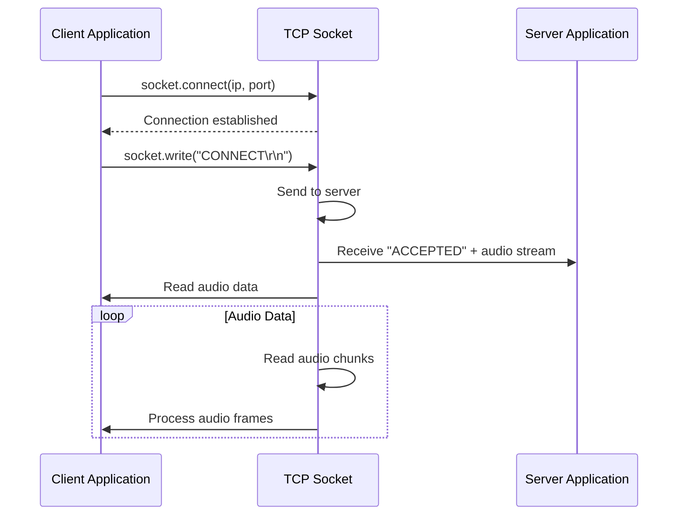

# API Reference

This document describes the data structures, functions, and communication interfaces used by the Music Player application.

**Note:** This application uses a custom protocol rather than a traditional REST API. However, the data interfaces follow similar patterns.

---

## Table of Contents

1. [C Sharp Bridge API](#1-c-sharp-bridge-api)
2. [Redux State API](#2-redux-state-api)
3. [Streaming Protocol](#3-streaming-protocol)
4. [YouTube Integration API](#4-youtube-integration-api)
5. [Web Interface API](#5-web-interface-api)
6. [Database API](#6-database-api)
7. [Cross-Platform Notes](#7-cross-platform-notes)

---

## 1. C Sharp Bridge API

The C# backend exposes methods to the JavaScript frontend via the `window.MusicPlayer` global object.

**Implementation:** Uses CefGlue.Avalonia's `ExecuteJavaScript` to inject the `window.MusicPlayer` object. Communication is via `window.external` pattern (JS → C#) and `ExecuteJavaScript` (C# → JS).

### Global Object: `window.MusicPlayer`

#### Methods

| Method | Signature | Description | Returns |
|------|------|------|------|
| `togglePlay()` | `() => void` | Toggles play/pause | void |
| `nextSong()` | `() => void` | Skips to next song | void |
| `playSong(jsonSong)` | `(json: string) => void` | Plays a specific song (JSON) | void |
| `toggleShuffle(shuffle)` | `(shuffle: boolean) => void` | Toggles shuffle mode | void |
| `setVolume(volume)` | `(volume: number) => void` | Sets volume (0-100) | void |
| `seekVideo(position)` | `(position: number) => void` | Seeks video to position (ms) | void |
| `moveToTime(seconds)` | `(seconds: number) => void` | Seeks audio to time (seconds) | void |
| `stop()` | `() => void` | Stops playback | void |
| `hostServer(port)` | `(port: number) => void` | Starts hosting music server | void |
| `connectToServer(ip, port)` | `(ip: string, port: number) => void` | Connects to remote server | void |
| `disconnectServer()` | `() => void` | Disconnects from server | void |
| `startVideo(url)` | `(url: string) => void` | Starts YouTube video playback | void |
| `stopVideo()` | `() => void` | Stops video playback | void |
| `copySongs(source, dest, count)` | `(src, dst, n: number) => void` | Copies random songs | void |
| `openFolder()` | `() => void` | Opens folder browser dialog | void |
| `openFiles()` | `() => void` | Opens file browser for multiple files | void |

### Global Functions (via window.CSSharpDispatcher)

| Function | Signature | Description |
|------|------|------|
| `dispatchSetCurrentSong(jsonSong)` | `(song: object) => void` | Sets current song in Redux |
| `dispatchSetServerInfo(jsonInfo)` | `(info: object) => void` | Updates server info in Redux |
| `dispatchSetCopyProgress(progress)` | `(percent: number) => void` | Updates copy progress |

### C# Backend Implementation

**File:** `MusicPlayerWeb/MusicPlayerGate.cs`, `MusicPlayerWeb/MusicPlayerGate.Actions.cs`

**Key methods:**
- `TogglePlay()` - Calls `_player?.TogglePlay()`
- `NextSong()` - Calls `_player?.Next()`
- `Play(string jsonSong)` - Deserializes JSON and calls `_player?.Play(song)`
- `SetVolume(int percentage)` - Calls `_player?.SetVolume(percentage)`
- `SeekVideo(double position)` - Calls `ctrl?.Seek(position)` (IVideo)
- `MoveToTime(long seconds)` - Calls `_player?.MoveToTime(seconds)`
- `Stop()` - Disposes player, calls `SongChanged(null)`
- `HostServer(int port)` - Creates server player, calls `ServerInfoChanged()`
- `ConnectToServer(string ip, int port)` - Creates client player, saves IP to `SettingType.RemoteIP`
- `StartVideo(string url)` - Creates video player, calls `video.StartVideo(url)`
- `CopySongs(string source, string dest, int number)` - Uses `Factory.GetCopy()`

**JS Interop Pattern:**
```csharp
// C# → JS: Using ExecuteJavaScript
_browser.ExecuteJavaScript($"window.CSSharpDispatcher.dispatchSetCurrentSong({json})", "musicplayer", 0);

// JS → C#: Via window.external (traditional)
window.external && window.external.TogglePlay && window.external.TogglePlay();
```

---

## 2. Redux State API

The Redux store manages application state across all components.

### Store Structure

```javascript
// Reducer imports
import { currentSong } from './Reducers/CurrentSong.jsx';
import { serverInfo } from './Reducers/ServerInfo.jsx';
import { copyProgress } from './Reducers/Copy.jsx';

// State shape
const initialState = {
    currentSong: null,
    serverInfo: null,
    copyProgress: null
};

const store = createStore(
    combineReducers({
        currentSong,
        serverInfo,
        copyProgress
    }),
    initialState
);
```

### CurrentSong Reducer

**State slice:**
```javascript
{
    currentSong: null | SongObject
}
```

**SongObject structure:**
```javascript
{
    Title: string;
    Artist: string;
    Album: string;
    Genre: string;
    Year: string;
    Composer: string;
    TrackNumber: number;
    DiscNumber: number;
    BitRate: number;     // kbps
    SampleRate: number;  // Hz
    Channels: number;    // 2 or 6
    Duration: number;    // milliseconds
    FilePath: string;
    PlayCount: number;
    LastPlayed: string;  // ISO 8601
    // Additional TagLib# fields...
}
```

**Actions:**
```javascript
// Dispatch actions
window.CSSharpDispatcher.dispatchSetCurrentSong(songJson);

// In React
import { SongActions } from './DataStore/StoreActions';
store.dispatch(SongActions.setCurrentSong(song));
```

### ServerInfo Reducer

**State slice:**
```javascript
{
    serverInfo: null | ServerInfoObject
}
```

**ServerInfoObject structure:**
```javascript
{
    IsHost: boolean;           // true = hosting server
    Host: string;              // IP address
    Port: number;              // Port number
    Clients: Record<string, number>; // "{IP: port}" map
    VideoUrl: string | null;   // Current YouTube URL
    VideoPosition: number;     // Current position in ms
}
```

### CopyProgress Reducer

**State slice:**
```javascript
{
    copyProgress: null | number   // 0-100 percentage
}
```

---

## 3. Streaming Protocol

The custom TCP-based streaming protocol used between server and clients.

### Connection Lifecycle



### Protocol Format

**Connection handshake:**

```
Client -> Server: "CONNECT\r\n"
Server -> Client: "ACCEPTED\r\n"

// Then audio stream follows
```

**Audio frames:**
- Format: PCM audio data (or compressed)
- Size: 16KB chunks (efficient streaming)
- Timing: Real-time, no buffering (live)

### Server Commands

**Server can send to all clients:**

| Command | Format | Description |
|------|------|------|
| CONNECT | `"CONNECT\r\n"` | Allow new connection |
| PLAY | `"PLAY:{volume}\r\n"` | Start playing at volume |
| PAUSE | `"PAUSE\r\n"` | Pause playback |
| SEEK:{position} | `"SEEK:123456\r\n"` | Jump to position |
| VOLUME:{value} | `"VOLUME:75\r\n"` | Set volume |
| VIDEO:{url} | `"VIDEO:https://youtube.com/..."` | Switch video |
| POSITION:{position} | `"POSITION:123456\r\n"` | Current video position |

### Client Commands

**Client can send to server:**

| Command | Format | Description |
|------|------|------|
| CONNECT | `"CONNECT\r\n"` | Request connection |
| DISCONNECT | `"DISCONNECT\r\n"` | Close connection |
| PLAY | `"PLAY:123456,85\r\n"` | Play at position 123456 with volume 85 |
| PAUSE | `"PAUSE\r\n"` | Pause playback |
| POSITION_UPDATE:{position} | `"POSITION_UPDATE:123456\r\n"` | Sync position |
| VOLUME:{value} | `"VOLUME:75\r\n"` | Set volume |

---

## 4. YouTube Integration API

YouTube API endpoints used by the application.

### Iframe API

```javascript
// Create player
const player = new YT.Player('youtube-player', {
    height: '360',
    width: '640',
    videoId: 'VIDEOID',
    events: {
        'onReady': onReadyFunc,
        'onStateChange': onStateChangeFunc
    }
});

// Methods accessed via 'player' instance
player.loadVideoById(videoId);
player.playVideo();
player.pauseVideo();
player.stopVideo();
player.seekTo(time, allowSeekAhead);
player.setVolume(volume);
player.isPlaying() => boolean;
player.getCurrentTime() => number;
```

### URL Parsing API

```javascript
function extractVideoId(url) {
    const youtubeRegex = /(?:youtube\.com\/(?:[^\/]+\/.+\/|(?:v|e(?:mbed)?)\/|.*[?&]v=)|youtu\.be\/)([^"&?\-\s]+)/;
    const match = url.match(youtubeRegex);
    return match ? match[1] : null;
}

function extractPlaylistId(url) {
    const listRegex = /(list=)([^&]+)/;
    const match = url.match(listRegex);
    return match ? match[2] : null;
}

function extractFromWatchPage(url) {
    const watchRegex = /v=([a-zA-Z0-9_-]+)/;
    const match = url.match(watchRegex);
    return match ? match[1] : null;
}
```

### Playlist Data Structure

Response from YouTube Data API or scraped endpoints:

```javascript
[
    {
        ID: string;          // e.g., "abc123"
        Title: string;
        ThumbnailUrl: string; // e.g., "https://img.youtube.com/vi/abc123/mqdefault.jpg"
        Description: string;
        Duration: number;    // Optional
        Url: string;         // Direct video URL
        Views?: number;      // Optional
    }
]
```

---

## 5. Web Interface API

React web interface components API.

### Component Props

**Home Props:**
```javascript
{
    match: {
        isExact: boolean  // true if current route
    }
}
```

**Server Props:**
```javascript
{
    serverInfo: ServerInfoObject   // {IsHost, Host, Port, Clients, VideoUrl, VideoPosition}
}
```

**Client Props:**
```javascript
{
    serverInfo: ServerInfoObject
}
```

**Video Props:**
```javascript
{
    serverInfo: ServerInfoObject
}
```

### Event Handlers

```javascript
// Home component
openFolder()          // Open folder dialog
openFiles()           // Open file dialog
gotoServer()          // Navigate to /server
gotoClient()          // Navigate to /client
gotoCopy()            // Navigate to /copy
goto(url)             // Navigate to route

// Server component
hostServer(port: number)    // Host server
disconnectServer()          // Disconnect all
```

---

## 6. Database API

SQLite database operations via Microsoft.Data.Sqlite (migrated from System.Data.SQLite).

### Db Class Interface

```csharp
public static class Db
{
    // Get entities
    public static IEnumerable<Song> GetSongs() => songTable.ToArray();
    public static IEnumerable<Album> GetAlbums() => albumTable.ToArray();
    public static IEnumerable<Artist> GetArtists() => artistTable.ToArray();
    public static IEnumerable<Playlist> GetPlaylists() => playlistTable.ToArray();
    
    // Search
    public static IEnumerable<Song> SearchSongs(string query) => ...
    public static IEnumerable<Song> SearchByArtist(string artist) => ...
    public static IEnumerable<Song> SearchByAlbum(string album) => ...
    
    // Get by ID
    public static Song GetSongById(int id) => ...
    public static Song GetSongByPath(string path) => ...
    
    // Add
    public static void AddSong(Song song) => ...
    public static void AddAlbum(Album album) => ...
    
    // Update
    public static void UpdateSong(Song song) => ...
    public static void DeleteSong(Song song) => ...
    
    // Stats
    public static int GetTotalSongs() => ...
    public static long GetTotalSize() => ...
    
    // Path management
    public static void ScanFolder(string folderPath) => ...
    public static void ScanFiles(string[] filePaths) => ...
    public static void DeleteMissingFiles(string[] missingPaths) => ...
}
```

### Entity Tables

**Songs Table:**
```sql
CREATE TABLE Songs (
    Id INTEGER PRIMARY KEY AUTOINCREMENT,
    Title TEXT,
    Artist TEXT,
    Album TEXT,
    Genre TEXT,
    TrackNumber INTEGER,
    DiscNumber INTEGER,
    Year TEXT,
    BitRate INTEGER,
    SampleRate INTEGER,
    Channels INTEGER,
    Duration INTEGER,  -- milliseconds
    FilePath TEXT,
    PlayCount INTEGER DEFAULT 0,
    LastPlayed TEXT,
    Picture TEXT,  -- Base64 or file path
    FOREIGN KEY (Artist) REFERENCES Artists(Id),
    FOREIGN KEY (Album) REFERENCES Albums(Id)
);
```

**Albums Table:**
```sql
CREATE TABLE Albums (
    Id INTEGER PRIMARY KEY AUTOINCREMENT,
    Title TEXT NOT NULL,
    Artist TEXT,  -- Artist ID or name
    Year TEXT,
    Genre TEXT,
    Picture TEXT
);
```

**Artists Table:**
```sql
CREATE TABLE Artists (
    Id INTEGER PRIMARY KEY AUTOINCREMENT,
    Name TEXT UNIQUE NOT NULL
);
```

**Playlists Table:**
```sql
CREATE TABLE Playlists (
    Id INTEGER PRIMARY KEY AUTOINCREMENT,
    Name TEXT NOT NULL,
    Creator TEXT,
    Picture TEXT
);
```

**Playlist-Song Junction:**
```sql
CREATE TABLE PlaylistSongs (
    PlaylistId INTEGER,
    SongId INTEGER,
    Position INTEGER,
    PRIMARY KEY (PlaylistId, SongId),
    FOREIGN KEY (PlaylistId) REFERENCES Playlists(Id),
    FOREIGN KEY (SongId) REFERENCES Songs(Id)
);
```

---

## 7. Cross-Platform Notes

### Technology Stack (.NET 10 + Avalonia + CefGlue)

**Framework:** .NET 10 (net10.0)
**UI Framework:** Avalonia 11.2.3 (cross-platform desktop UI)
**Browser Control:** CefGlue.Avalonia 120.6099.1 (Chromium-based, cross-platform)

### Platform Support

| Platform | Status | Notes |
|----------|--------|-------|
| Windows (x64) | ✅ Supported | Tested, CEF 120 binaries included |
| Linux (x64) | ✅ Supported | Tested (current build platform) |
| macOS (x64) | ⚠️ Pending test | Need to verify CEF 120 binaries |

### Audio Playback (NAudio)

**Library:** NAudio (cross-platform via WaveOutEvent)
**Volume Control:** `DataController.SetSetting<int>(SettingType.Volume, percentage)`

**Implementation:**
```csharp
// MusicPlayer.cs
_volume = DataController.GetSetting<int>(SettingType.Volume, 50);
_player.SetVolume(_volume);

// Volume range: 0-100
```

### File Dialogs (Avalonia)

**Implementation:** Uses Avalonia's `TopLevel.StorageProvider` API
```csharp
var topLevel = TopLevel.GetTopLevel(control);
var result = await topLevel.StorageProvider.OpenFilePickerAsync(options);
```

### Known Limitations

1. **CEF Binaries:** Must be available for each platform (Windows/Linux/macOS)
2. **Audio Output:** NAudio's WaveOutEvent works cross-platform, but advanced audio features may be platform-specific
3. **Database:** Microsoft.Data.Sqlite works cross-platform, but file paths must be handled correctly

---

**Last Updated:** 2026-06-11 (Webpack 5 upgrade documented)
