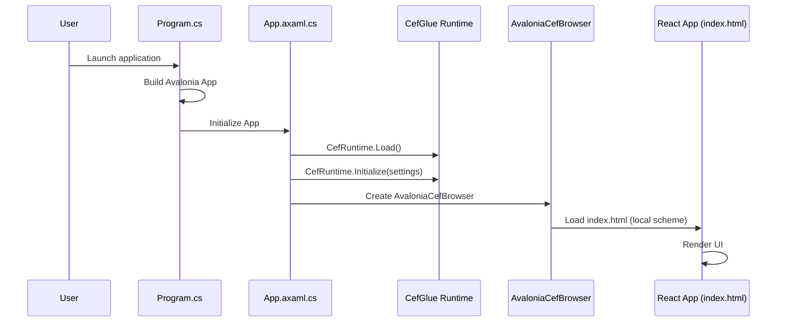
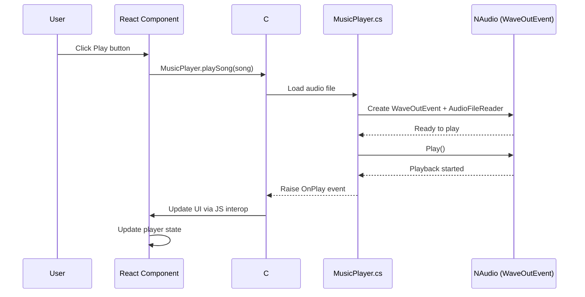
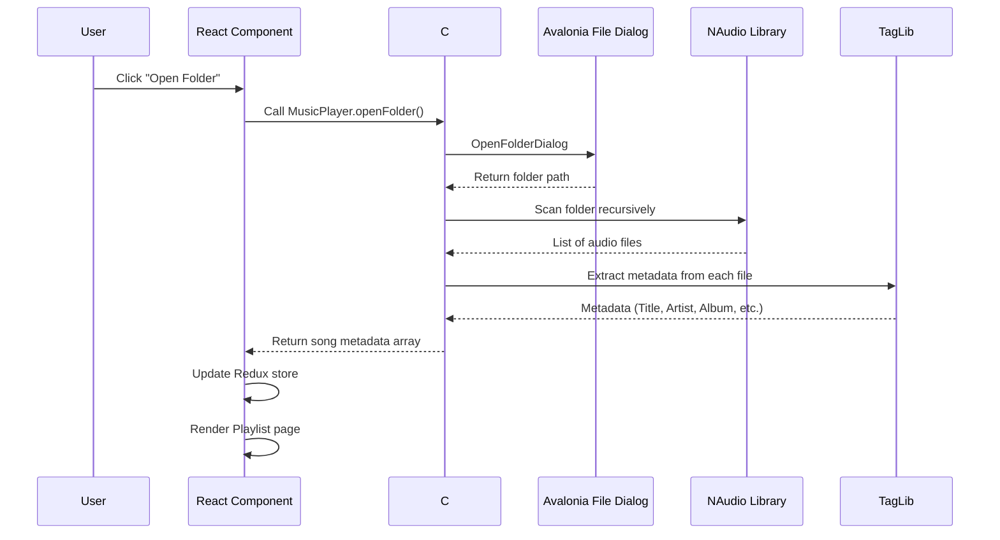
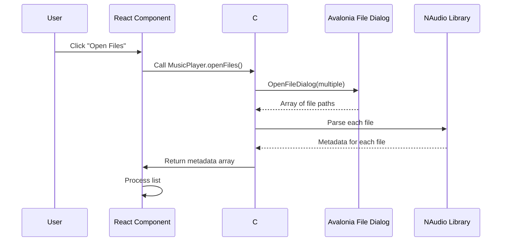
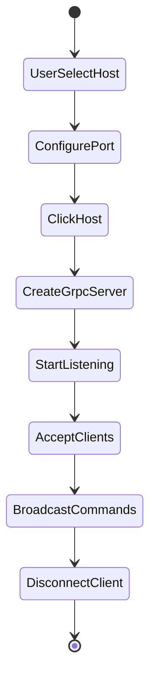
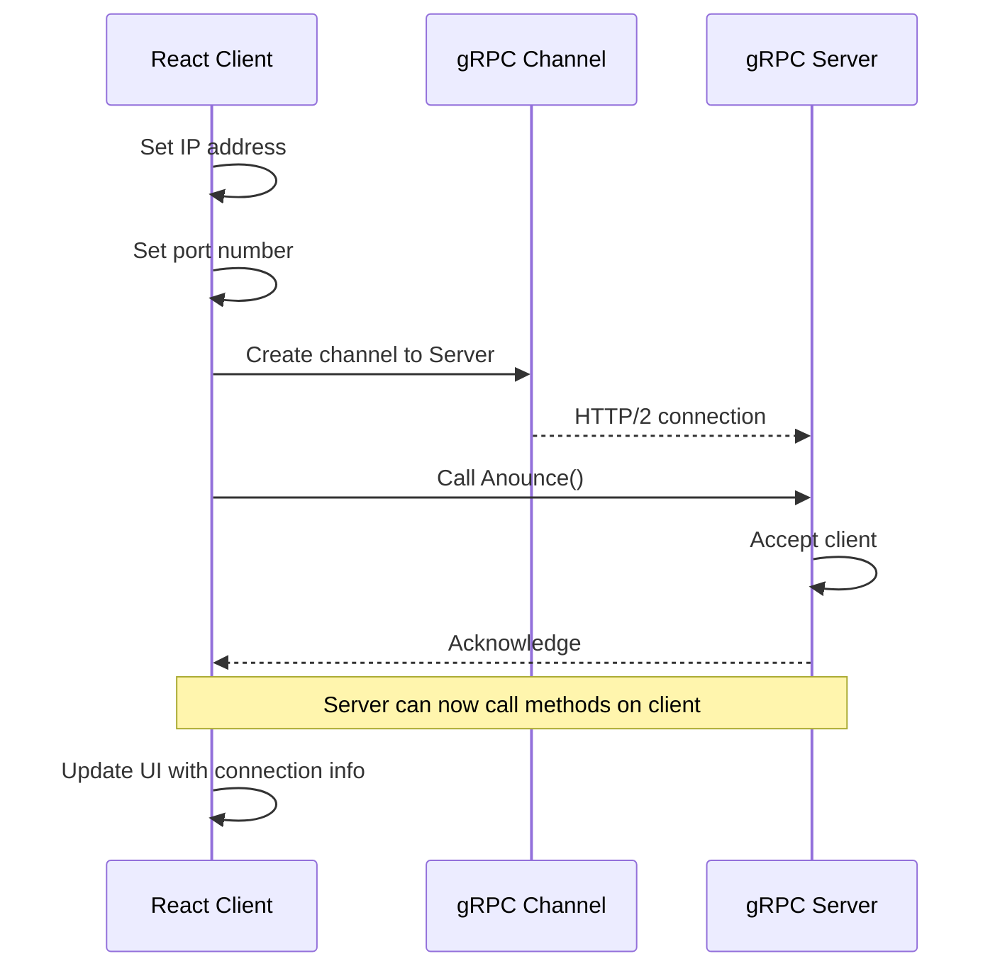
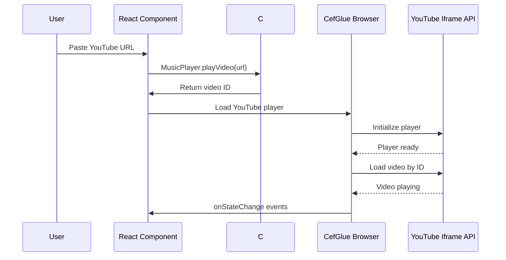

# How It Works

Last updated: 2026-06-11
Status: Updated for .NET 10 + Avalonia + CefGlue.Avalonia

---

## 1. Application Startup

### Overview

The Music Player is a **cross-platform desktop application** built with:
- **.NET 10** (targeting `net10.0` for Windows/Linux/macOS)
- **Avalonia 11.2.3** (cross-platform UI framework)
- **CefGlue.Avalonia 120.6099.1** (Chromium Embedded Framework for Avalonia)
- **React** (frontend UI rendered in Chromium browser)

### Startup Sequence



**Step-by-step:**

1. `Program.cs` builds Avalonia application with `AppBuilder.Configure<App>().UsePlatformDetect()`
2. `Program.cs` initializes CefGlue via `CefRuntimeLoader.Initialize()` with:
   - Custom scheme handler for `local://` protocol
   - `--single-process` flag to avoid GPU process crashes on Linux
   - `--disable-gpu` flag for additional GPU stability
3. `App.xaml.cs` `OnFrameworkInitializationCompleted()`:
   - Creates `MainWindow` instance and assigns to `IClassicDesktopStyleApplicationLifetime.MainWindow` (critical for window display)
   - Logs startup status and writes errors to `~/.local/share/MusicPlayerWeb/startup-error.log`
4. `MainWindow.axaml.cs` constructor:
   - Creates `AvaloniaCefBrowser` and sets `Address` to `local://custom/index.html`
   - Wraps browser in `Decorator` control from XAML
   - Sets up `LoadEnd` event to initialize JS interop after browser loads
   - Creates `MusicPlayerGate` instance to bridge C# and JavaScript
5. CefGlue project references (from `docs/CefGlue-main/`):
   - `CefGlue.Avalonia.csproj`
   - `CefGlue.csproj`
   - `CefGlue.Common.csproj`
   - `CefGlue.Common.Shared.csproj`
6. Import `CefGlue.CopyLocal.props` and `CefGlue.Common.targets` for CEF binary handling
7. Browser loads `local://custom/index.html` via custom `SchemeHandlerFactory`
8. React application bootstraps and calls C# Bridge methods

### Runtime Identifiers

The application supports three platforms:
- **Windows**: `win-x64`
- **Linux**: `linux-x64`
- **macOS**: `osx-x64`

Build command: `dotnet build -r <rid>` (e.g., `dotnet build -r win-x64`)

---

## 2. Local Song Playback

### Overview

The application plays audio files using **NAudio** library with cross-platform support.

**Key components:**
- `MusicPlayer.cs` - Core player logic (uses `WaveOutEvent` for cross-platform audio)
- `Song.cs` - Metadata model
- `NAudio` - Audio playback library

### Playback Flow



### Folder Import Flow



#### Step-by-Step:
1. User clicks "Open Folder"
2. `Home.jsx` calls `MusicPlayer.openFolder()`
3. Avalonia shows cross-platform folder picker (`OpenFolderDialog`)
4. Selected folder path returned
5. NAudio scans recursively
6. Each file parsed by NAudio
7. Metadata extracted by TagLib#
8. Song objects constructed
9. Redux `currentSong` updated (first file)
10. Playlist renders all tracks

### File Import Flow



### Metadata Extraction

**TagLib# 2.1.0** processes:
- ID3v1 headers (basic MP3)
- ID3v2 frames (full MP3)
- Vorbis comments (OGG)
- MP4 meta boxes (M4A)
- FLAC picture/metadata blocks
- OGG Vorbis headers
- Apple lossless tags

Extracted fields:
```csharp
public class Song
{
    public string Title { get; set; }
    public string Artist { get; set; }
    public string Album { get; set; }
    public string Genre { get; set; }
    public int TrackNumber { get; set; }
    public int DiscNumber { get; set; }
    public string Year { get; set; }
    public string Picture { get; set; }  // Cover art base64 or path
    public uint BitRate { get; set; }
    public uint SampleRate { get; set; }
    public uint Channels { get; set; }
    public TimeSpan Duration { get; set; }
    public string FilePath { get; set; }
    // ... many more fields
}
```

### Volume Control

Volume control is handled via NAudio's `WaveOutEvent.Volume` property (0.0 to 1.0):
- `MusicPlayer.SetVolume(double volume)` - Sets playback volume
- Cross-platform compatible (no Windows-specific CoreAudioApi)
- UI slider in React calls `MusicPlayer.setVolume()` via C# Bridge

---

## 3. Server & Client Communication (gRPC)

### Overview

The application uses **gRPC** (replacing WCF duplex contracts) for real-time client-server communication.

```
Protocol: gRPC over HTTP/2
Port: 5000 (server), 5001 (client, configurable)
Serialization: Protocol Buffers (binary)
```

### gRPC Services (musicplayer.proto)

Two services defined:

1. **MusicPlayerServerService** - Methods called by client on server:
   - `Anounce` - Client announcement (join server)
   - `Goodbye` - Client disconnection
   - `GetCurrentPosition` - Get playback position

2. **MusicPlayerClientService** - Methods called by server on client:
   - `PlayVideo`, `SeekVideo`, `SetSongPosition`, `SetSong`
   - `SendFile`, `Play`, `PlayRadio`, `Pause`, `Disconnect`

### Server Mode



**When user clicks "Host":**

1. User enters/accepts port (default: 5000)
2. `Factory.cs::GetServerPlayer()` creates gRPC server
3. `GrpcServerService.cs` hosts MusicPlayerServerService
4. Server begins listening on configured port
5. Clients connect via `Factory.cs::GetClientPlayer()`

**Client connection:**

1. Client sets server IP/port
2. `GrpcClientContract.cs` creates gRPC channel
3. Client calls `Anounce()` on server
4. Server maintains client list
5. `serverInfo.Clients` updated
6. Server can call methods on client via MusicPlayerClientService

### Client Mode



**Connection flow:**

1. Client sets IP/port
2. `MusicPlayer.connectToServer(ip, port)` called
3. Creates gRPC channel to server
4. Calls `Anounce()` to register
5. Server acknowledges
6. Server can now send commands to client (Play, Pause, etc.)
7. UI updates with connection info

### gRPC vs WCF Comparison

| Feature | WCF (Old) | gRPC (New) |
|---------|-----------|------------|
| Duplex contracts | NetTcpBinding | Bidirectional streaming |
| Serialization | XML/DataContract | Protocol Buffers |
| Platform support | Windows-only | Cross-platform |
| Performance | Slower | Faster (binary) |
| .NET 10 support | ❌ Removed | ✅ Native support |

---

## 4. YouTube Video Integration

### YouTube API Usage

The app uses **YouTube's Iframe API** for video playback and **YoutubeExplode 6.3.10** for metadata.

```javascript
// Creates YouTube player
const player = new YT.Player('youtube-player', {
    videoId: 'abc123',  // YouTube video ID
    suggestedQuality: 'hd1080',
    events: {
        'onReady': (event) => { /* Setup */ },
        'onStateChange': (event) => { /* Handle state */ }
    }
});
```

### Playback Flow



### JavaScript Interop (CefGlue.Avalonia)

The C# Bridge communicates with React via **CefGlue.Avalonia** browser:

```csharp
// Execute JavaScript in browser
browser.ExecuteJavaScript("MusicPlayer.playSong(" + songJson + ")");

// Evaluate JavaScript (with return value)
var result = await browser.EvaluateJavaScript<string>("MusicPlayer.getState()");
```

**Key differences from CefSharp:**
- Uses `LoadEnd` event instead of `FrameLoadEnd`
- `ExecuteJavaScript()` called directly on `AvaloniaCefBrowser`
- `EvaluateJavaScript<T>()` for typed return values
- No `MainFrame` property - execute directly on browser object

---

## 5. C# Bridge (MusicPlayerGate)

### Overview

`MusicPlayerGate.cs` acts as the bridge between the React frontend and C# backend.

**Responsibilities:**
- Expose C# methods to JavaScript via `window.MusicPlayer`
- Handle callbacks from React to C# backend
- Manage browser interop (execute JS, evaluate JS)
- Use `AvaloniaCefBrowser` for all browser interactions

### Bridge Methods

| Method | Description |
|--------|-------------|
| `playSong(songJson)` | Play a local song |
| `playVideo(url)` | Play YouTube video |
| `pause()` | Pause playback |
| `resume()` | Resume playback |
| `setVolume(volume)` | Set volume (0.0-1.0) |
| `openFolder()` | Open folder dialog, import songs |
| `openFiles()` | Open file dialog, import songs |
| `connectToServer(ip, port)` | Connect to gRPC server |
| `hostServer(port)` | Start gRPC server |

### Threading (Avalonia Dispatcher)

UI updates must be marshaled to Avalonia UI thread:

```csharp
// Correct way (Avalonia)
Dispatcher.UIThread.Post(() =>
{
    // UI update code here
});
```

This replaces WPF's `Dispatcher.Invoke()` for cross-platform compatibility.

---

## 6. Cross-Platform Architecture

### Technology Stack

| Component | Technology | Purpose |
|-----------|------------|---------|
| Runtime | .NET 10 (`net10.0`) | Cross-platform runtime |
| UI Framework | Avalonia 11.2.3 | Cross-platform UI |
| Browser | CefGlue.Avalonia 120.6099.1 | Chromium rendering |
| Audio | NAudio (WaveOutEvent) | Cross-platform audio |
| Metadata | TagLib# 2.1.0 | Audio metadata |
| Communication | gRPC | Client-server |
| Frontend | React | User interface |

### Platform Support

| Platform | Runtime ID | Status |
|----------|------------|--------|
| Windows x64 | `win-x64` | ✅ Build tested |
| Linux x64 | `linux-x64` | ✅ Build tested |
| macOS x64 | `osx-x64` | ⏳ Pending test |

### CEF Binaries

CefGlue requires platform-specific CEF binaries:
- Windows: `libcef.dll` (shipped with application)
- Linux: `libcef.so` (shipped with application)
- macOS: `libcef.dylib` (shipped with application)

The `CefRuntime.Load()` call must find these binaries at runtime.

---

## 7. Application Settings

### Settings Storage

Settings are stored in `settings.json` (user's home directory):

```json
{
  "RemoteIP": "192.168.1.100",
  "Port": 5000,
  "Volume": 0.8,
  "LastFolder": "/home/user/Music",
  "Theme": "dark"
}
```

### Accessing Settings

```csharp
// Get setting
var ip = SettingType.RemoteIP.GetSetting();

// Set setting
SettingType.RemoteIP.SetSetting("192.168.1.50");
```

Settings are strongly-typed using `SettingType` enum (replaces old `Setting.Type`).

---

## 8. Build & Run

### Prerequisites

- .NET 10 SDK
- Avalonia 11.2.3
- CefGlue.Avalonia 120.6099.1

### Build Commands

```bash
# Build for current platform
dotnet build MusicPlayerWeb/MusicPlayerWeb.csproj

# Build for specific platform
dotnet build -r win-x64 MusicPlayerWeb/MusicPlayerWeb.csproj
dotnet build -r linux-x64 MusicPlayerWeb/MusicPlayerWeb.csproj
dotnet build -r osx-x64 MusicPlayerWeb/MusicPlayerWeb.csproj
```

### Run

```bash
cd MusicPlayerWeb
dotnet run -r win-x64  # or linux-x64, osx-x64
```

---

## 9. Known Limitations

1. **macOS testing pending** - Build succeeds but runtime not tested on macOS
2. **CEF binary distribution** - Must ship platform-specific CEF binaries with app
3. **Mobile not supported** - Avalonia mobile support is experimental, desktop-first approach
4. **Volume control** - Implemented via NAudio `WaveOutEvent.Volume`, tested on Linux/Windows

---

## 10. Migration Notes (.NET 4.5.2 → .NET 10)

### Key Changes

| Old (.NET 4.5.2 + WPF) | New (.NET 10 + Avalonia) |
|-------------------------|---------------------------|
| WPF + CefSharp.Wpf | Avalonia + CefGlue.Avalonia |
| `UseWPF` in csproj | Removed (Avalonia packages) |
| `FrameLoadEnd` event | `LoadEnd` event |
| `MainFrame.ExecuteJavaScript()` | `browser.ExecuteJavaScript()` |
| `WaveOut` (NAudio) | `WaveOutEvent` (cross-platform) |
| `CoreAudioApi` | Removed (Windows-only) |
| `Dispatcher.Invoke()` | `Dispatcher.UIThread.Post()` |
| `Setting.Type.RemoteIP` | `SettingType.RemoteIP` |
| WCF duplex contracts | gRPC services |
| Windows-only | Cross-platform (win/linux/mac) |

---
