# How It Works

This document explains the inner workings of each major feature and system component in Music Player.

## Table of Contents

1. [Initialization & Startup](#1-initialization--startup)
2. [Audio Playback System](#2-audio-playback-system)
3. [Server & Client Streaming](#3-server--client-streaming)
4. [YouTube Video Integration](#4-youtube-video-integration)
5. [Internet Radio Discovery](#5-internet-radio-discovery)
6. [File Copy Utility](#6-file-copy-utility)
7. [State Management Flow](#7-state-management-flow)
8. [React Component Hierarchy](#8-react-component-hierarchy)
9. [Data Flow & Communication](#9-data-flow--communication)
10. [Database Operations](#10-database-operations)

---

## 1. Initialization & Startup

### WPF Application Startup

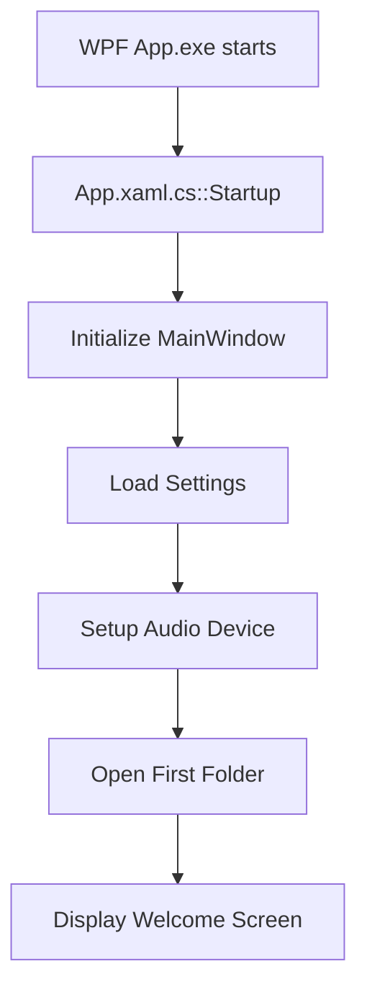

1. `App.xaml.cs::Startup()` initializes WPF
2. `MainWindow.xaml.cs::MainWindow()` creates main window
3. Loads user preferences from Settings
4. NAudio initializes audio device
5. `Initialize.ps1` (optional) sets up shortcuts

### CefSharp Browser Startup

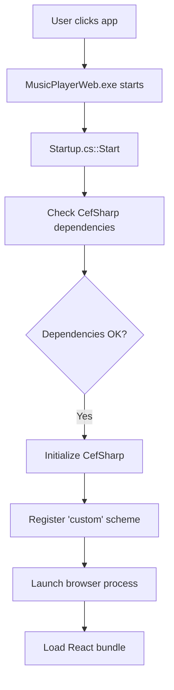

1. `Startup.cs` validates CefSharp DLLs
2. Registers custom HTTP scheme
3. CefSharp processes launch
4. Web bundle (webpack output) loads
5. React app mounts to DOM

### React App Initialization

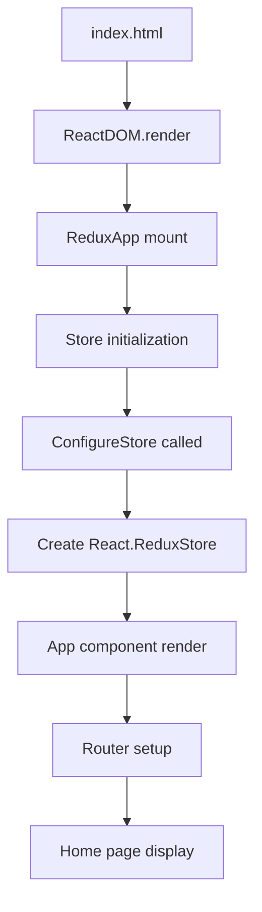

1. `index.html` references CefSharp bridge
2. `ReduxApp` mounts Redux provider
3. `Store` initialized with reducers
4. `App` renders with React Router
5. Routes to `/` (Home) by default
6. C# functions attached to `window.MusicPlayer`

---

## 2. Audio Playback System

### Component Hierarchy

```
MusicPlayer (WPF/Namespace)
├── Song (model)
├── Album (model)
├── Artist (model)
├── Db (SQLite operations)
└── [Other entities]
```

### Importing Music

#### Folder Import Flow

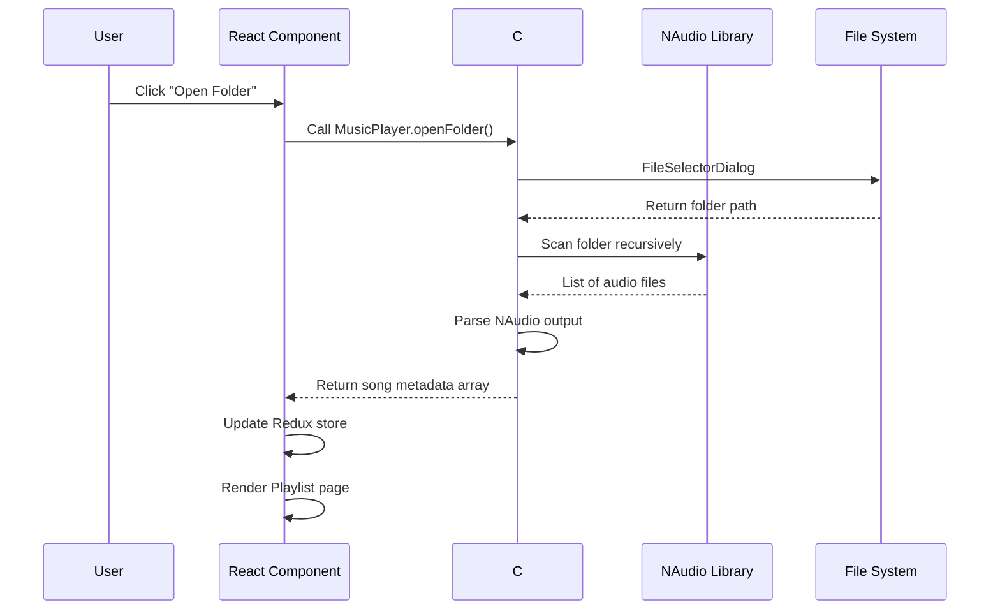

#### Step-by-Step:
1. User clicks "Open Folder"
2. `Home.jsx` calls `MusicPlayer.openFolder()`
3. WPF shows Windows folder picker
4. Selected folder path returned
5. NAudio scans recursively
6. Each file parsed by NAudio
7. Metadata extracted by TagLib#
8. Song objects constructed
9. Redux `currentSong` updated (first file)
10. Playlist renders all tracks

#### File Import Flow

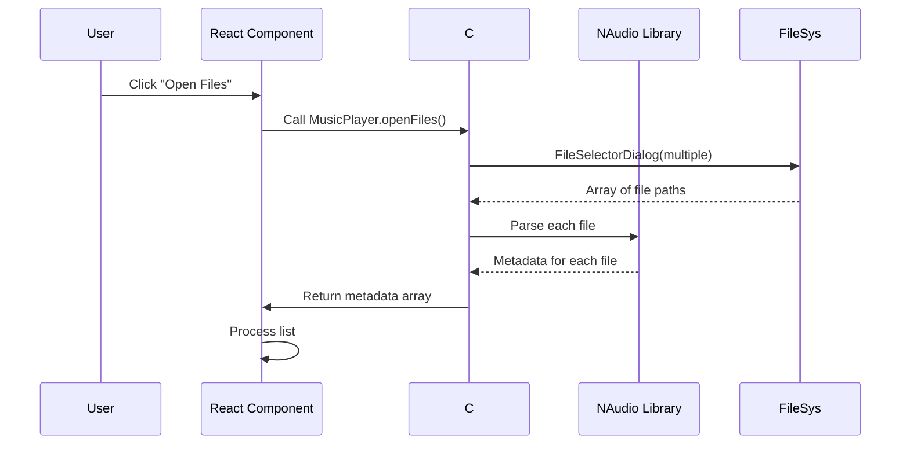

1. User clicks "Open Files"
2. `Home.jsx` calls `MusicPlayer.openFiles()`
3. WPF file picker (multiple selection)
4. C# reads all file paths
5. NAudio parses each file
6. Metadata extracted
7. Array of Song objects built
8. Queue for import or display

### Metadata Extraction

**TagLib#** processes:
- ID3v1 headers (basic MP3)
- ID3v2 frames (full MP3)
- Vorbis comments (OGG)
- MP4 meta boxes (M4A)
- FLAC picture/metadata blocks
- OGG Vorbis headers
- Apple lossless tags

Extracted fields:
```csharp
public class Song
{
    public string Title { get; set; }
    public string Artist { get; set; }
    public string Album { get; set; }
    public string Genre { get; set; }
    public int TrackNumber { get; set; }
    public int DiscNumber { get; set; }
    public string Year { get; set; }
    public string Picture { get; set; }  // Cover art base64 or path
    public uint BitRate { get; set; }
    public uint SampleRate { get; set; }
    public uint Channels { get; set; }
    public TimeSpan Duration { get; set; }
    public string FilePath { get; set; }
    // ... many more fields
}
```

---

## 3. Server & Client Streaming

### Protocol Overview

The application uses a **custom TCP-based protocol** for real-time streaming.

```
Port: ~8963 (configurable)
Protocol: Custom binary/text-based
Encryption: None (upgrade needed)
Authentication: None (upgrade needed)
```

### Server Mode

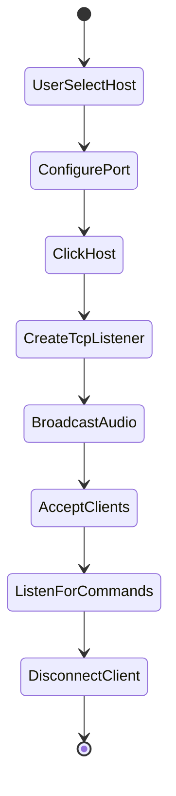

**When user clicks "Host":**

1. User enters/accepts port (default: 8963)
2. `MusicPlayer.hostServer(port)` called
3. C# creates `TcpListener`
4. Accepts client connections
5. Server begins broadcasting audio
6. Clients connect via `MusicPlayer.connectToServer()`

**Client connection:**

1. Client requests connection
2. Server validates (if auth implemented)
3. Client receives audio stream
4. Server maintains client list
5. `serverInfo.Clients` updated

### Client Mode

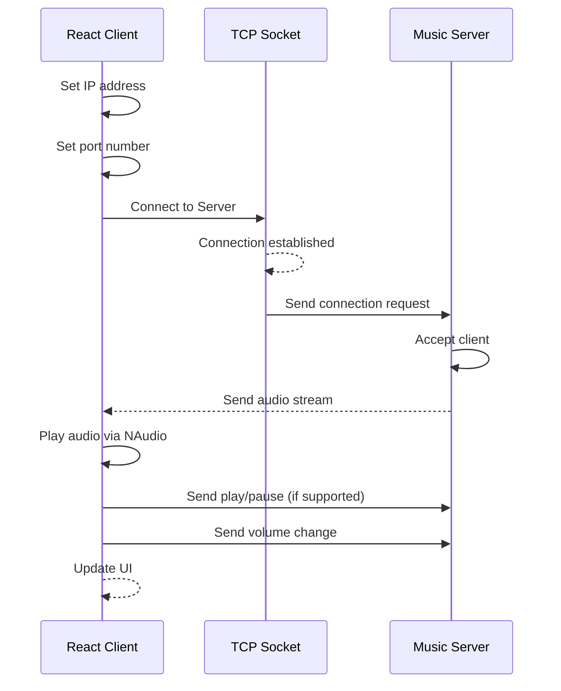

**Connection flow:**

1. Client sets IP/port
2. `MusicPlayer.connectToServer(ip, port)`
3. Creates `Socket` connection
4. Sends connection request
5. Server replies with handshake
6. Audio stream begins
7. Client receives audio data
8. Client renders via NAudio
9. UI updates with connection info

### Broadcast Mechanics

**How broadcast works:**

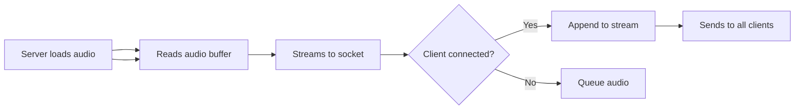

**Key operations:**

- **Server hosts audio** via NAudio
- **Reads audio data** from song files
- **Writes to TCP socket** stream
- **Broadcasts to all clients**
- **Clients receive** on their sockets
- **Decodes and plays** via NAudio
- **Synchronized** playback across clients

### YouTube Sync

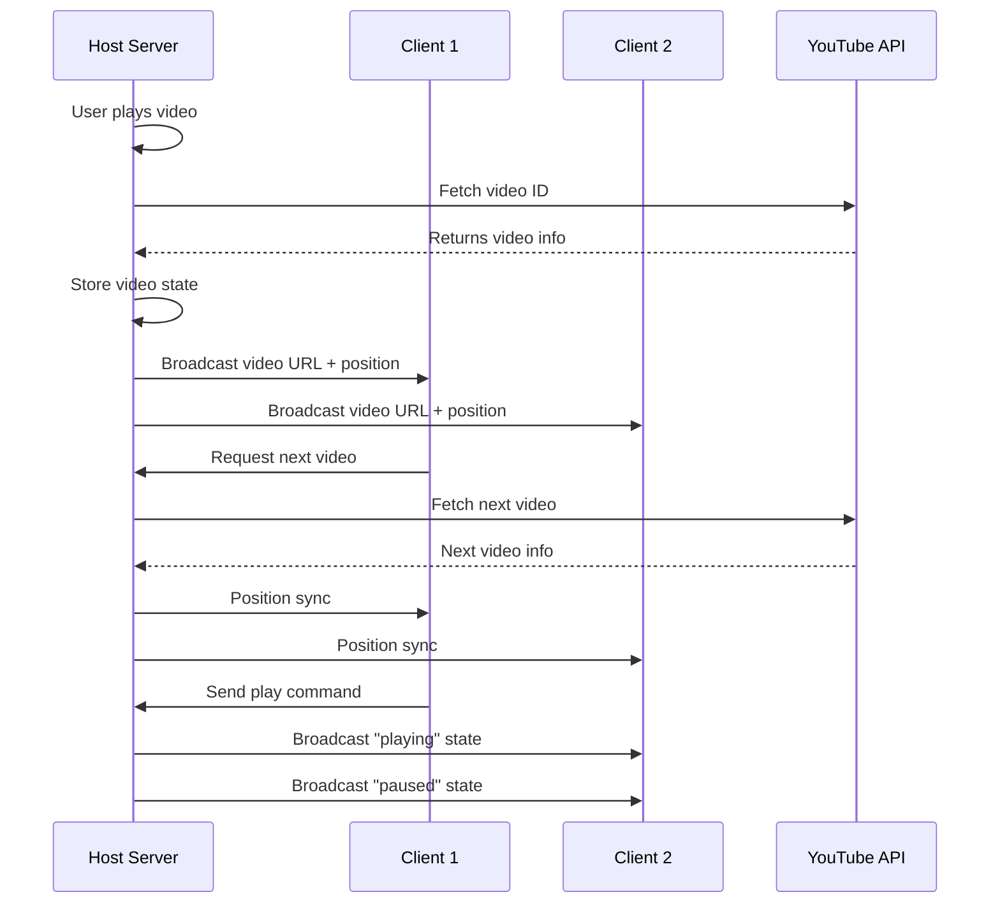

**Sync mechanism:**

1. Host plays YouTube in CefSharp
2. Host extracts video ID from URL
3. Host sends to all clients: `{videoId, position, state}`
4. Clients receive via socket
5. Clients render same video in local CefSharp
6. Position updates synchronize
7. State changes (play/pause) broadcast to others

---

## 4. YouTube Video Integration

### YouTube API Usage

The app uses **YouTube's Iframe API** for video playback.

```javascript
// Creates YouTube player
const player = new YT.Player('youtube-player', {
    videoId: 'abc123',  // YouTube video ID
    suggestedQuality: 'hd1080',
    events: {
        'onReady': (event) => { /* Setup */ },
        'onStateChange': (event) => { /* Update state */ }
    }
});
```

### YouTube URL Parsing

```javascript
function resolveVideoUrl() {
    // Case: list=playlistId
    if (url.indexOf('list=') > -1) {
        const parts = url.split('list=');
        return parts[parts.length - 1];
    }
    
    // Case: ?v=videoId
    if (url.indexOf('?v=') > -1) {
        const parts = url.split('?v=');
        return parts[parts.length - 1].length === 11 ? parts[parts.length - 1] : null;
    }
    
    // Case: /watch?v=videoId
    // Extract v parameter from URL
    return null;
}
```

### Playlist Handling

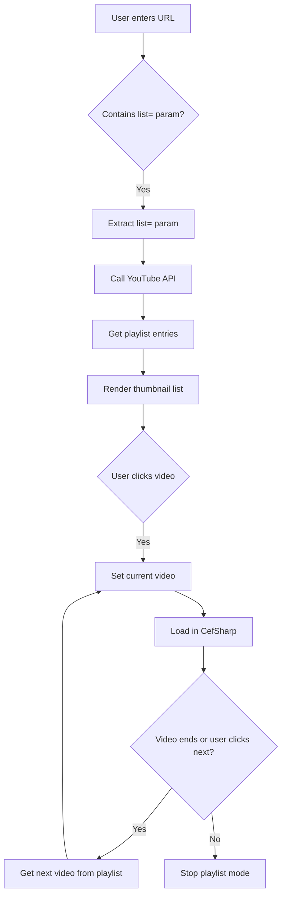

**Playlist workflow:**

1. URL parser detects `list=` parameter
2. Extract playlist ID
3. Call YouTube Data API (or scrape alternative)
4. Receive array of {ID, Title, Thumbnail, Description}
5. Render as clickable thumbnails
6. User clicks a video
7. Load video into YouTube Iframe player
8. When video completes, auto-next
9. Get next video from playlist array
10. Repeat until playlist exhausted

### Channel Video Fetching

```javascript
MusicPlayer.getChannelVideos().then((json) => {
    // Get latest videos from channel
    const videos = JSON.parse(json);
    this.setState({ videoInfo: videos });
});
```

**Uses YouTube Search API** to query channel uploads.

---

## 5. Internet Radio Discovery

### Search Flow

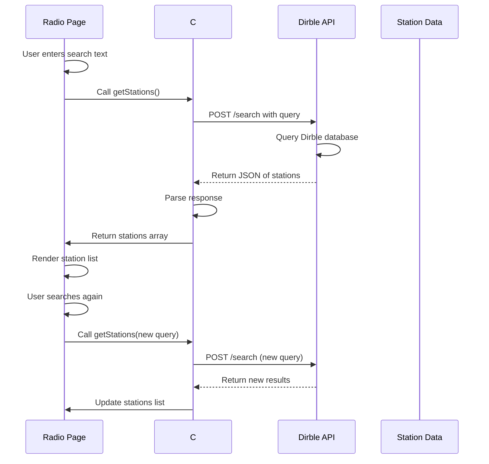

**Process:**

1. User types search text
2. `changeSearchText()` called
3. `getStations()` triggered
4. C# calls Dirble API
5. API searches database
6. Returns JSON of matching stations
7. React parses and stores
8. First 25 stations rendered
9. "Load more" fetches next 25

### Station Management

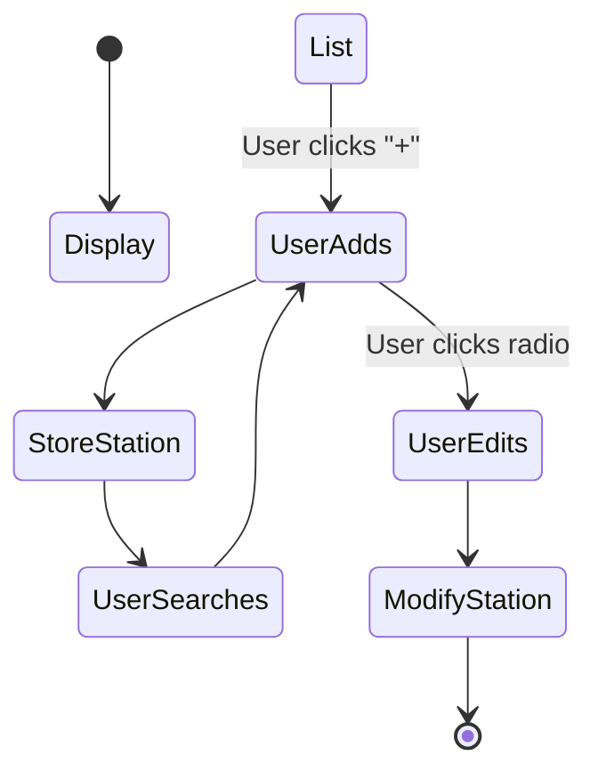

**Station data stored in:**

- `allStations` - Full search results
- `stations` - Currently displayed (paginated)
- `index` - Current page index

---

## 6. File Copy Utility

### Copy Process

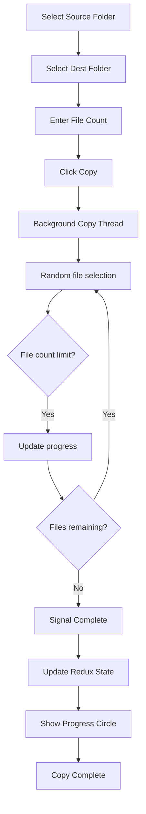

**Copy algorithm:**

1. User picks source
2. User picks destination
3. Specifies `count = 500` (default)
4. Click "Copy"
5. Background thread spawns
6. Generates random file indices
7. Copies files from source to dest
8. Updates progress in Redux
9. UI shows progress circle
10. UI remains responsive
11. Copies completes
12. Progress indicates `100`
13. Thread exits

**File selection:**

- Uses random selection to avoid copying all
- Avoids duplicate paths
- Respects count limit
- May skip large files (configurable?)

---

## 7. State Management Flow

### Redux Store Structure

```javascript
// Store.jsx
const initialState = {
    currentSong: null,
    serverInfo: null,
    copyProgress: null
};

const reducers = combineReducers({
    currentSong,    // CurrentSong.jsx
    serverInfo,     // ServerInfo.jsx
    copyProgress    // Copy.jsx
});

export const store = createStore(reducers, initialState);
```

### Dispatch Flow

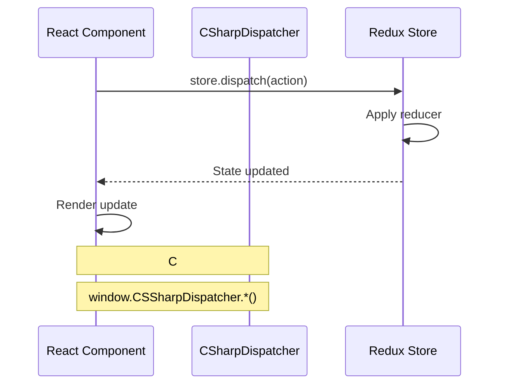

### Action Types

**Current Song Actions:**
- `setCurrentSong(song)` - Play new track
- `clearCurrentSong()` - Stop playback

**Server Info Actions:**
- `setServerinfo(info)` - Connection established
- `updateClientList(clients)` - Update clients
- `setVideoState(videoUrl, position)` - YouTube sync

**Copy Progress Actions:**
- `changeCopyProgress(percent)` - Update progress
- `clearCopyProgress()` - Copy complete

---

## 8. React Component Hierarchy

```
App.jsx
├── HashRouter (React Router)
│   ├── Route / → Home.jsx
│   │   └── Renders main menu carousel
│   ├── Route /playlist → PlayList.jsx
│   │   ├── SongList.jsx
│   │   └── Song.jsx (current track)
│   ├── Route /server → Server.jsx
│   │   ├── Port input
│   │   └── Host/Disconnect buttons
│   ├── Route /client → Client.jsx
│   │   ├── IP input
│   │   ├── Port input
│   │   └── Connect/Disconnect buttons
│   ├── Route /copy → Copy.jsx
│   │   ├── Source folder picker
│   │   ├── Destination folder picker
│   │   ├── File count input
│   │   └── Progress circle
│   ├── Route /video → Video.jsx
│   │   ├── URL input (read-only when connected)
│   │   ├── YouTube player (iframe)
│   │   └── Video thumbnail grid
│   ├── Route /radio → Radio.jsx
│   │   ├── Search bar
│   │   └── RadioList component
│   └── Route /radio/:id → EditRadio (edit favorite)
│
└── Navigation Bar (dynamic items)
    ├── Home (always)
    ├── Playlist (when playing)
    ├── Server (when hosting)
    ├── Client (when connected)
    ├── Video (when YouTube playing)
    ├── Radio (when stations available)
    └── Copy (when copying active)
```

### Component Communication

**Props from parent (`mapStateToProps`):**
```javascript
function mapStateToProps(state) {
    return {
        currentSong: state.currentSong,
        serverInfo: state.serverInfo,
        copyProgress: state.copyProgress
    };
}
export default connect(mapStateToProps)(Component);
```

**Global C# Bridge:**
```javascript
window.CSSharpDispatcher = {
    dispatchSetCurrentSong(jsonSong),
    dispatchSetServerinfo(jsonInfo),
    dispatchSetCopyProgress(progress)
};
```

C# backend calls:
```csharp
// From C# code
window.CSSharpDispatcher.dispatchSetCurrentSong(songJson);
window.CSSharpDispatcher.dispatchSetServerinfo(serverJson);
window.CSSharpDispatcher.dispatchSetCopyProgress(50);
```

---

## 9. Data Flow & Communication

### C# to React Communication

**Mechanism:** CefSharp global object + JSON parsing

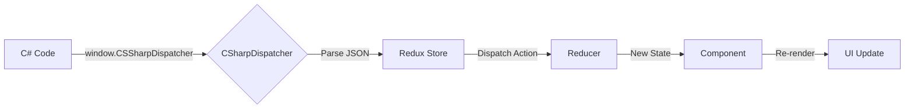

### React to C# Communication

**Mechanism:** C# methods exposed via `window.MusicPlayer`

```javascript
// From React
MusicPlayer.openFolder();
MusicPlayer.hostServer(8963);
MusicPlayer.connectToServer(ip, port);
```

### Redux State Structure

```javascript
{
    currentSong: null | {
        title,
        artist,
        album,
        genre,
        duration,
        path,
        // ... many fields
    },
    
    serverInfo: null | {
        IsHost: boolean,
        Host: string,
        Port: number,
        Clients: {
            "192.168.1.100": 8963,
            "192.168.1.101": 8963
        },
        VideoUrl: string | null,
        VideoPosition: number // milliseconds
    },
    
    copyProgress: null | number // 0-100
}
```

---

## 10. Database Operations

### SQLite Schema

```sql
-- Tables for library persistence
CREATE TABLE Songs (
    Id INTEGER PRIMARY KEY,
    Title TEXT NOT NULL,
    Artist TEXT NOT NULL,
    Album TEXT,
    Genre TEXT,
    TrackNumber INTEGER,
    DiscNumber INTEGER,
    Year TEXT,
    BitRate INTEGER,
    Duration INTEGER,
    FilePath TEXT NOT NULL
);

CREATE TABLE Stations (
    Id INTEGER PRIMARY KEY,
    Name TEXT NOT NULL,
    StreamUrl TEXT NOT NULL,
    Genre TEXT,
    Region TEXT,
    Description TEXT,
    Picture TEXT
);

CREATE TABLE Favorites (
    StationId INTEGER,
    AddedDate TEXT,
    PRIMARY KEY (StationId)
);
```

### Usage Patterns

- Store library in SQLite
- Scan new folders → insert new rows
- Delete old/missing files
- Backup SQLite for library restore
- Query via LINQ `Db.<Entity>Query()`

---

## Appendix: Complete Flow Examples

### Full User Session

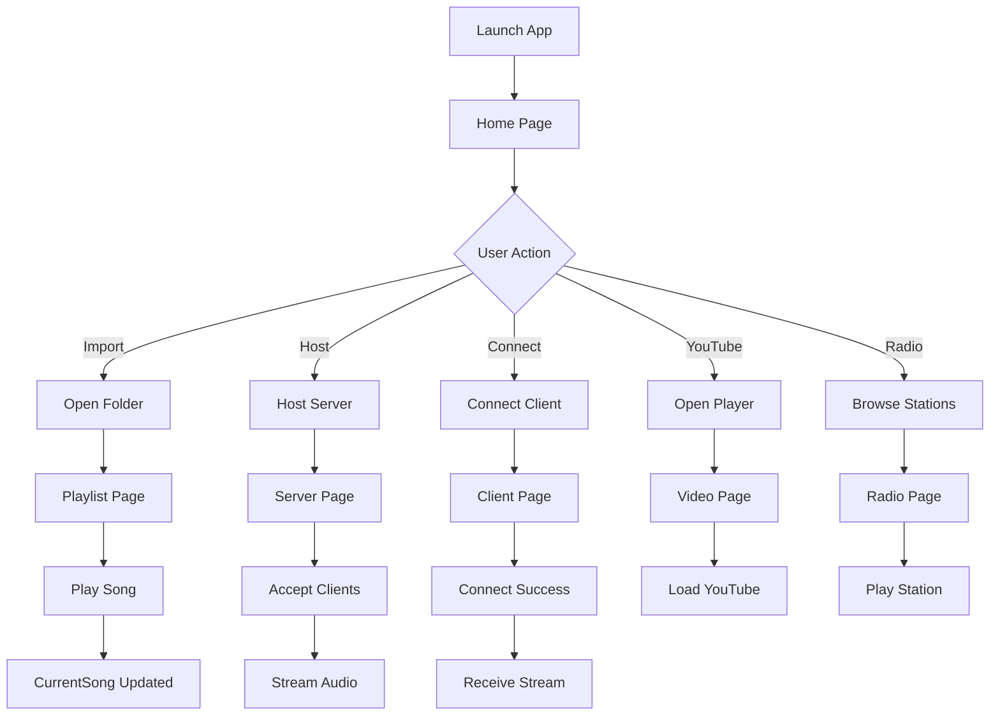

**Summary:** Each action triggers specific flows detailed in sections above.

---

## Troubleshooting Flow

**Issue: Videos not playing**
1. Check YouTube API key?
2. Verify CefSharp initialized?
3. Browser tab not blocked?

**Issue: Client can't connect**
1. Is server hosting?
2. Port not exposed?
3. Firewall blocking?
4. TCP socket open?

**Issue: Slow library loading**
1. Large library?
2. NAudio batch read?
3. Increase memory?
4. Scan fewer files?

**Issue: Radio stations not found**
1. API key valid?
2. Network to Dirble?
3. Search query working?

---

**End of How It Works documentation**
