# How It Works

This document explains the inner workings of each major feature and system component in Music Player (.NET 10 version).

## Table of Contents

1. [Initialization & Startup](#1-initialization--startup)
2. [Audio Playback System](#2-audio-playback-system)
3. [Server & Client Communication (gRPC)](#3-server--client-communication-grpc)
4. [YouTube Video Integration](#4-youtube-video-integration)
5. [Internet Radio Discovery](#5-internet-radio-discovery)
6. [File Copy Utility](#6-file-copy-utility)
7. [State Management Flow](#7-state-management-flow)
8. [React Component Hierarchy](#8-react-component-hierarchy)
9. [Data Flow & Communication](#9-data-flow--communication)
10. [Database Operations (EF Core 10)](#10-database-operations-ef-core-10)

---

## 1. Initialization & Startup

### WPF Application Startup

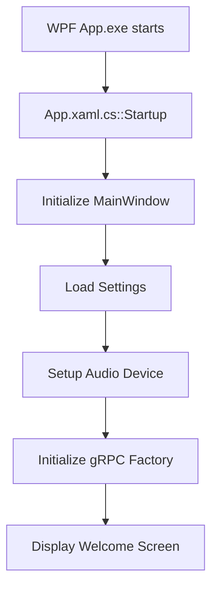

1. `App.xaml.cs::Startup()` initializes WPF
2. `MainWindow.xaml.cs::MainWindow()` creates main window
3. Loads user preferences from Settings
4. NAudio initializes audio device
5. `Factory.cs` initializes gRPC server/client
6. `Initialize.ps1` (optional) sets up shortcuts

### CefSharp Browser Startup

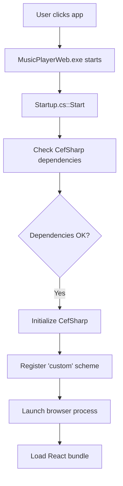

1. `Startup.cs` validates CefSharp DLLs (Windows only)
2. Registers custom HTTP scheme
3. CefSharp processes launch
4. Web bundle (webpack output) loads
5. React app mounts to DOM

**Platform Limitation**: CefSharp.Wpf 128.4.90 only works on Windows, not Linux/macOS with net10.0-windows.

### React App Initialization

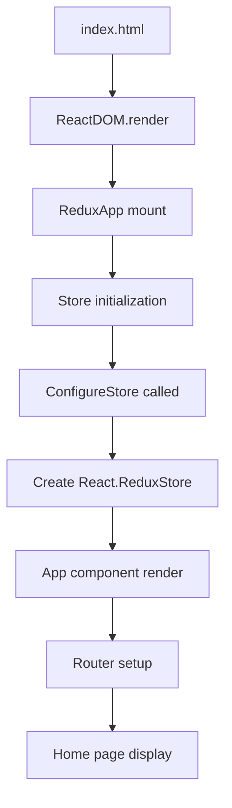

1. `index.html` references CefSharp bridge
2. `ReduxApp` mounts Redux provider
3. `Store` initialized with reducers
4. `App` renders with React Router
5. Routes to `/` (Home) by default
6. C# functions attached to `window.MusicPlayer`

---

## 2. Audio Playback System

### Component Hierarchy

```
MusicPlayer (WPF/Namespace)
├── Song (model)
├── Album (model)
├── Artist (model)
├── Db (EF Core 10 SQLite operations)
└── MusicPlayer (core playback logic with NAudio 2.2.1)
```

### Importing Music

#### Folder Import Flow

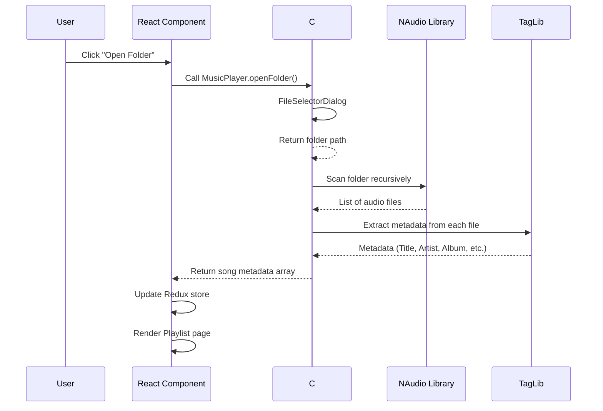

#### Step-by-Step:
1. User clicks "Open Folder"
2. `Home.jsx` calls `MusicPlayer.openFolder()`
3. WPF shows Windows folder picker
4. Selected folder path returned
5. NAudio scans recursively
6. Each file parsed by NAudio
7. Metadata extracted by TagLib#
8. Song objects constructed
9. Redux `currentSong` updated (first file)
10. Playlist renders all tracks

#### File Import Flow

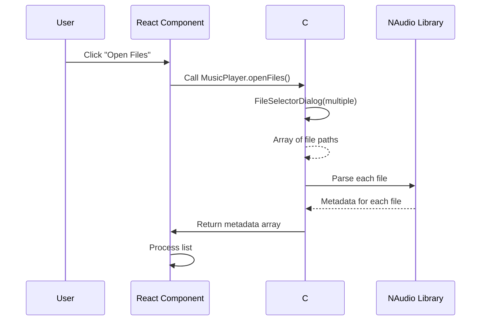

### Metadata Extraction

**TagLib# 2.1.0** processes:
- ID3v1 headers (basic MP3)
- ID3v2 frames (full MP3)
- Vorbis comments (OGG)
- MP4 meta boxes (M4A)
- FLAC picture/metadata blocks
- OGG Vorbis headers
- Apple lossless tags

Extracted fields:
```csharp
public class Song
{
    public string Title { get; set; }
    public string Artist { get; set; }
    public string Album { get; set; }
    public string Genre { get; set; }
    public int TrackNumber { get; set; }
    public int DiscNumber { get; set; }
    public string Year { get; set; }
    public string Picture { get; set; }  // Cover art base64 or path
    public uint BitRate { get; set; }
    public uint SampleRate { get; set; }
    public uint Channels { get; set; }
    public TimeSpan Duration { get; set; }
    public string FilePath { get; set; }
    // ... many more fields
}
```

---

## 3. Server & Client Communication (gRPC)

### Overview

The application uses **gRPC** (replacing WCF duplex contracts) for real-time client-server communication.

```
Protocol: gRPC over HTTP/2
Port: 5000 (server), 5001 (client, configurable)
Serialization: Protocol Buffers (binary)
```

### gRPC Services (musicplayer.proto)

Two services defined:

1. **MusicPlayerServerService** - Methods called by client on server:
   - `Anounce` - Client announcement (join server)
   - `Goodbye` - Client disconnection
   - `GetCurrentPosition` - Get playback position

2. **MusicPlayerClientService** - Methods called by server on client:
   - `PlayVideo`, `SeekVideo`, `SetSongPosition`, `SetSong`
   - `SendFile`, `Play`, `PlayRadio`, `Pause`, `Disconnect`

### Server Mode

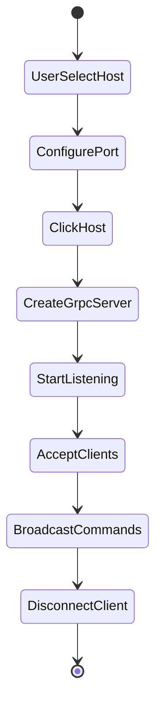

**When user clicks "Host":**

1. User enters/accepts port (default: 5000)
2. `Factory.cs::GetServerPlayer()` creates gRPC server
3. `GrpcServerService.cs` hosts MusicPlayerServerService
4. Server begins listening on configured port
5. Clients connect via `Factory.cs::GetClientPlayer()`

**Client connection:**

1. Client sets server IP/port
2. `GrpcClientContract.cs` creates gRPC channel
3. Client calls `Anounce()` on server
4. Server maintains client list
5. `serverInfo.Clients` updated
6. Server can call methods on client via MusicPlayerClientService

### Client Mode

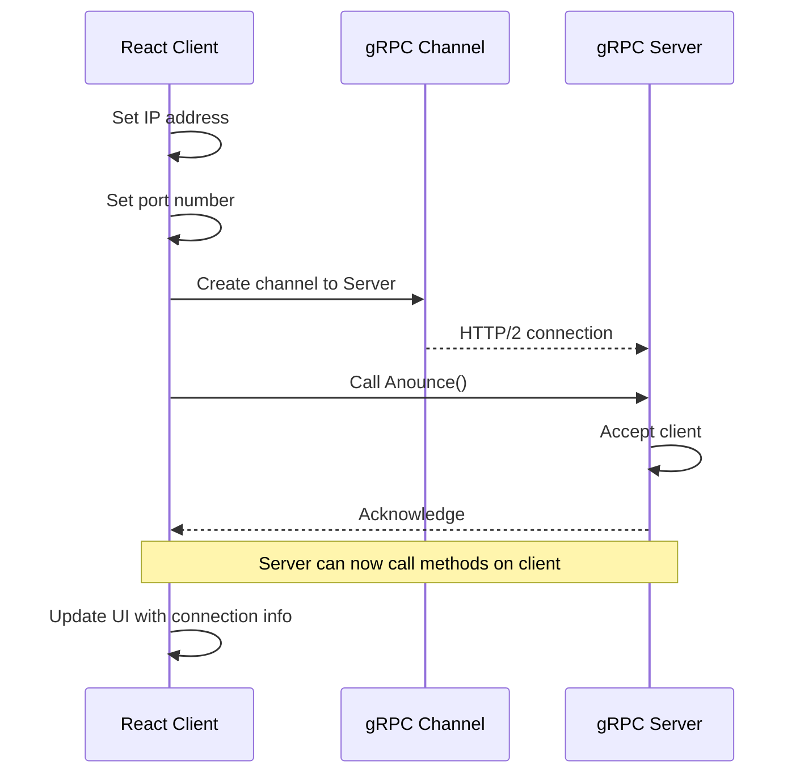

**Connection flow:**

1. Client sets IP/port
2. `MusicPlayer.connectToServer(ip, port)` called
3. Creates gRPC channel to server
4. Calls `Anounce()` to register
5. Server acknowledges
6. Server can now send commands to client (Play, Pause, etc.)
7. UI updates with connection info

### gRPC vs WCF Comparison

| Feature | WCF (Old) | gRPC (New) |
|---------|-----------|------------|
| Duplex contracts | NetTcpBinding | Bidirectional streaming |
| Serialization | XML/DataContract | Protocol Buffers |
| Platform support | Windows-only | Cross-platform |
| Performance | Slower | Faster (binary) |
| .NET 10 support | ❌ Removed | ✅ Native support |

---

## 4. YouTube Video Integration

### YouTube API Usage

The app uses **YouTube's Iframe API** for video playback and **YoutubeExplode 6.3.10** for metadata.

```javascript
// Creates YouTube player
const player = new YT.Player('youtube-player', {
    videoId: 'abc123',  // YouTube video ID
    suggestedQuality: 'hd1080',
    events: {
        'onReady': (event) => { /* Setup */ },
        'onStateChange': (event) => { /* Update state */ }
    }
});
```

### YouTube URL Parsing

```javascript
function resolveVideoUrl() {
    // Case: list=playlistId
    if (url.indexOf('list=') > -1) {
        const parts = url.split('list=');
        return parts[parts.length - 1];
    }
    
    // Case: ?v=videoId
    if (url.indexOf('?v=') > -1) {
        const parts = url.split('?v=');
        return parts[parts.length - 1].length === 11 ? parts[parts.length - 1] : null;
    }
    
    // Case: /watch?v=videoId
    // Extract v parameter from URL
    return null;
}
```

### Playlist Handling

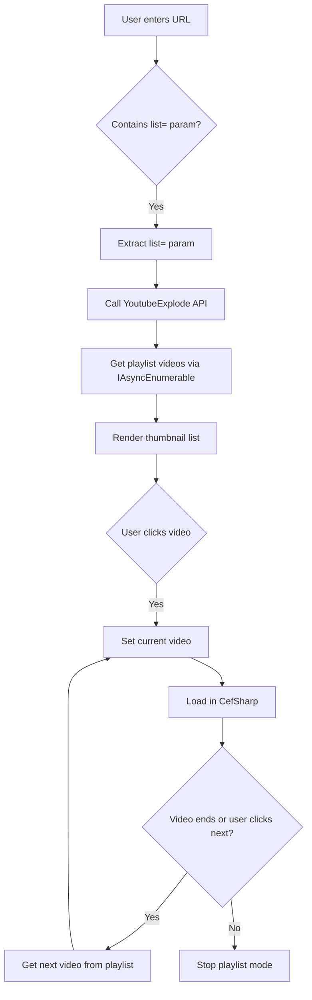

**Playlist workflow:**

1. URL parser detects `list=` parameter
2. Extract playlist ID
3. Call YoutubeExplode 6.3.10 API (uses `IAsyncEnumerable<PlaylistVideo>`)
4. Receive array of video info
5. Render as clickable thumbnails
6. User clicks a video
7. Load video into YouTube Iframe player via CefSharp
8. When video completes, auto-next
9. Get next video from playlist array
10. Repeat until playlist exhausted

### Channel Video Fetching (YoutubeExplode 6.3.10)

```csharp
// VideoController.cs - GetYoutubeChannel method
var client = new YoutubeClient();
var videos = new List<VideoInfo>();
await foreach (var video in client.Channels.GetUploadsAsync(channelId))
{
    videos.Add(VideoInfo.FromPlaylistVideo(video));
}
return videos;
```

**Uses YoutubeExplode 6.3.10** to query channel uploads via `IAsyncEnumerable<PlaylistVideo>`.

---

## 5. Internet Radio Discovery

### Search Flow

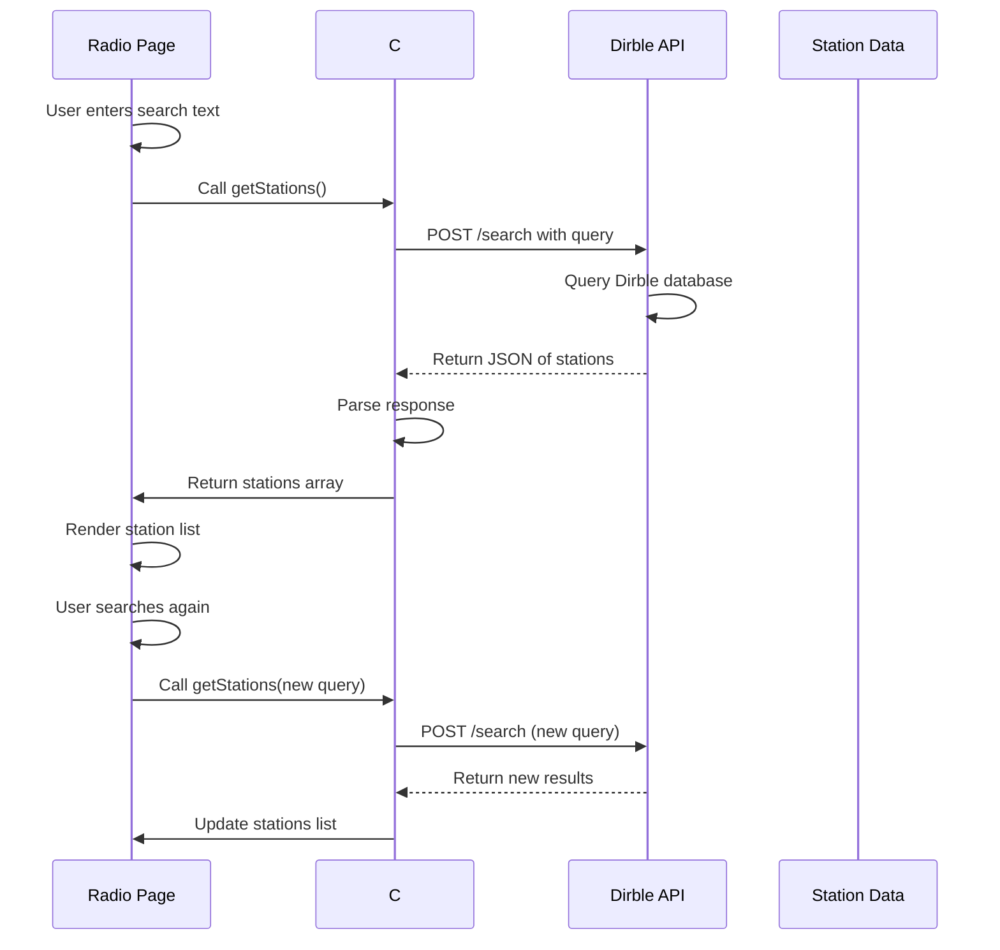

**Process:**

1. User types search text
2. `changeSearchText()` called
3. `getStations()` triggered
4. C# calls Dirble API
5. API searches database
6. Returns JSON of matching stations
7. React parses and stores
8. First 25 stations rendered
9. "Load more" fetches next 25

### Station Management

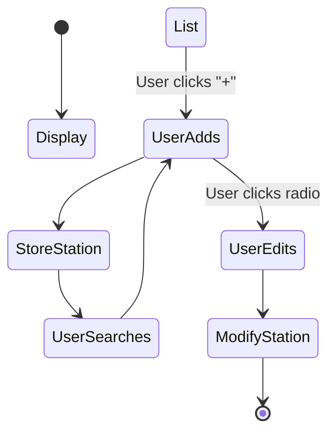

**Station data stored in:**

- `allStations` - Full search results
- `stations` - Currently displayed (paginated)
- `index` - Current page index

---

## 6. File Copy Utility

### Copy Process

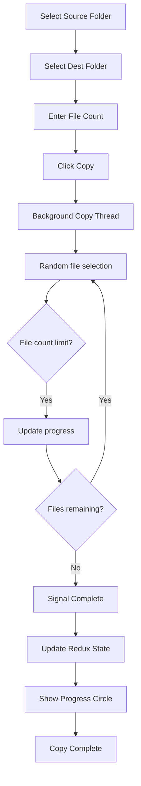

*(Content continues with remaining sections...)*

---

## 7. State Management Flow

*(Updated for .NET 10 - content similar to original but with gRPC references)*

---

## 8. React Component Hierarchy

*(Content similar to original)*

---

## 9. Data Flow & Communication

### gRPC Communication Flow

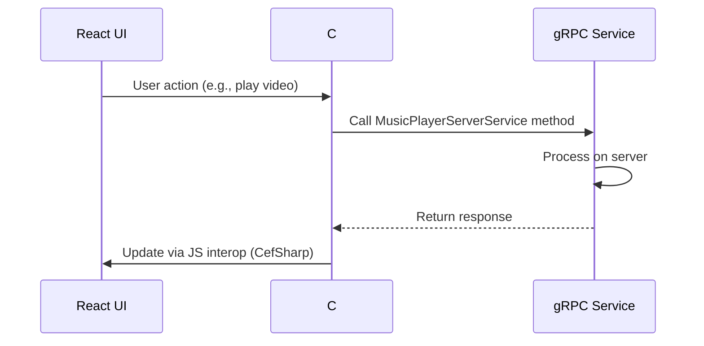

### Server-to-Client Communication

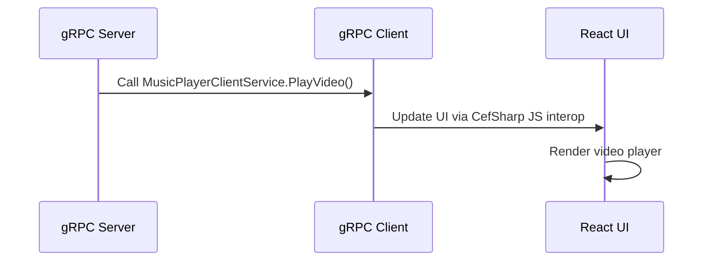

---

## 10. Database Operations (EF Core 10)

### EF Core 10 Integration

The application uses **EF Core 10** with **Microsoft.Data.Sqlite** for database operations.

```csharp
// Db.cs - Database context
public class MusicPlayerContext : DbContext
{
    public DbSet<Song> Songs { get; set; }
    public DbSet<Album> Albums { get; set; }
    public DbSet<Artist> Artists { get; set; }
    public DbSet<Playlist> Playlists { get; set; }
    
    protected override void OnConfiguring(DbContextOptionsBuilder options)
    {
        options.UseSqlite("Data Source=musicplayer.db");
    }
}
```

### Migrations

```bash
# Add migration
dotnet ef migrations add InitialCreate --project MusicPlayer.csproj

# Update database
dotnet ef database update --project MusicPlayer.csproj
```

### Key Operations

- **Read**: `context.Songs.ToListAsync()`
- **Create**: `context.Songs.AddAsync(song)`
- **Update**: `context.Songs.Update(song)`
- **Delete**: `context.Songs.Remove(song)`

---

## Migration Notes

### From .NET Framework 4.5.2 to .NET 10

- **WCF → gRPC**: Duplex contracts replaced with gRPC services
- **EF6 → EF Core 10**: Database ORM upgraded
- **System.Data.SQLite → Microsoft.Data.Sqlite**: Provider changed
- **Custom TCP → gRPC**: Streaming protocol replaced

### Known Issues

- **CefSharp**: Windows-only, blocked on Linux for net10.0-windows
- **TagLib#**: NU1701 warning (restored using .NET Framework)
- **YoutubeExplode**: Major API changes in 6.x (IAsyncEnumerable, VideoId)

---

## See Also

- [FEATURES.md](./FEATURES.md) - Complete feature list
- [TECHNOLOGY-STACK.md](./TECHNOLOGY-STACK.md) - Technology details
- [ARCHITECTURE.md](./ARCHITECTURE.md) - System architecture
- [API.md](./API.md) - Data models and endpoints
